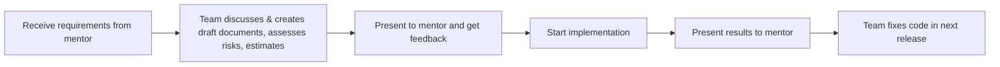

# Fullstack Intern Onboard

## Table of Contents

1. [Internship Roadmap](#1-internship-roadmap)
2. [Evaluation Criteria](#2-evaluation-criteria)
3. [Team Structure](#3-team-structure)
4. [Tech Stack](#5-tech-stack)
5. [System Portals & Services](#6-system-portals--services)
6. [Key Features](#7-key-features)
7. [Release Process](#4-release-process)
8. [Temporary Plan](#8-temporary-plan)

---

## 1. Internship Roadmap

- **1.5 months (7 interns):** Learn the main technologies used by the company
- **1.5 months (4 interns):** Join teams to work on real project tasks


## 2. Evaluation Criteria

- Self-learning ability
- Proactiveness
- Teamwork
- Work results


## 3. Team Structure

- 3 teams:
  - 2 team - 2 members
  - 1 team - 3 members


## 4. Tech Stack

- **Frontend:** ReactJS, HTML, SCSS, Redux, Vite, AntD
- **Backend:** Microservices, Nodejs, ExpressJs, Redis, Apollo Graphql Federation, SocketIo, gRPC, MongoDB (mongoose), Puppeteer


## 5. System Portals & Services

- **Frontend Portals:**

  - Portal (Patient, Clinic User, Admin)
  - Report

- **Backend Services:**
  - main-api
  - appointment-api
  - printer-manager
  - socket-server


## 6. Key Features

- **Roles:** Patient, Physician, Admin

### Patient

- Personal info: first name, last name, email, phone, address, date of birth
- Can create a Care Plan, request assignment of a physician, and change physician (requires admin approval; after approval, notification emails are sent to both patient and physician)
- Can input daily health data (heart rate, blood pressure, weight, height, SpO2, sleep, steps, etc.) and view charts by day, week, month
- Can book appointments with physicians (based on available working times) within their Care Plan or at the same facility
  - Supports both virtual and in-person appointments (currently, virtual appointments are skipped)

### Physician

- Personal info: first name, last name, email, phone, address, date of birth
- Can view their patient list and export PDF reports with patient data by week or month

### Admin

- Can manage (CRUD) physicians, facilities, and patients
- One facility can have multiple physicians
- One physician can belong to multiple facilities

### Authentication (JWT + Redis)

- username + has password
- save token to Redis

### Optional features

- (Optional) AI-powered patient data analysis


## 7. Release Process




## 8. Temporary Plan

- **Week 1:** Get familiar, set up devices, tools, etc. Get started with required technologies
  Exercise:

  - Personal: Word file answering 3 questions (What, Why, How) for each technology
  - Group: Create a demo CRUD and Patient list (with pagination):
    - FE: React, Apollo Client
    - BE: Nodejs, ExpressJs, Apollo Graphql, MongoDB + mongoose
    - Note:
      - Create default Physician list (khác bảng với Patient)
      - Link 1 Patient với 1 Physician
      - Patient object:
        ```js
        {
          email: String;
          phone: String;
          gender: Enum(Male / Female);
          dob: String(YYYY - MM - DD);
          physician: ID;
          addressInfo: {
            address: String;
            city: String;
            state: String;
            country: String;
          }
        }
        ```
      - Physician object:
        ```js
        {
          email: String;
          title: String;
          phone: String;
          gender: Enum(Male / Female);
          dob: String(YYYY - MM - DD);
        }
        ```

- **Week 2 (FS-1.0.0):** Build database, schema, API. Draw flow charts and system diagrams
- **Week 3 (FS-1.1.0):** Feature updates
- **Week 4 (FS-1.2.0):** Feature updates
- **Week 5 (FS-1.3.0):** Feature updates
- **Week 6:** Backup


## Others

- Dùng Slack chat
- Daily meeting bằng cách nhắn lên group chat chung báo cáo mỗi sáng (hôdm qua làm gì, hôm nay làm gì, có gặp khó khăn gì ko)
- Xin off
- Giữ im lặng giờ nghỉ trưa
